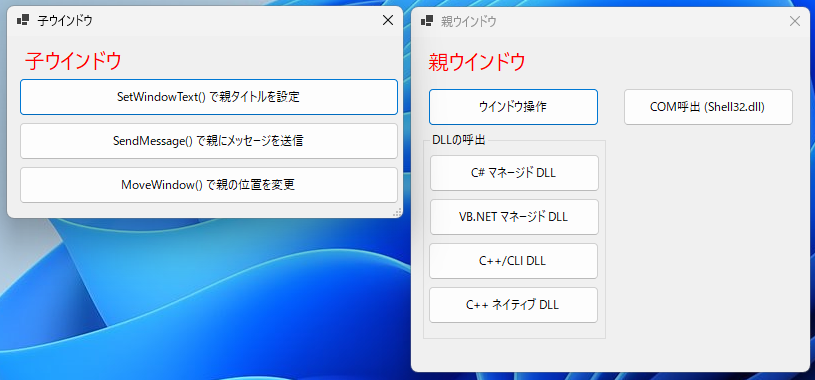

# WinFormsDemo

### C#からWindows APIを呼び出すなど応用的な処理を集めたサンプルです。

#### 主な機能

* 子ウインドウから親ウインドウを操作する例
* 各種DLLを呼び出す例

#### 開発環境

* Microsoft Visual Studio Community 2022 Version 17.9.1
* C# 
* VB.NET
* C++/CLI
* C++

#### thanks

